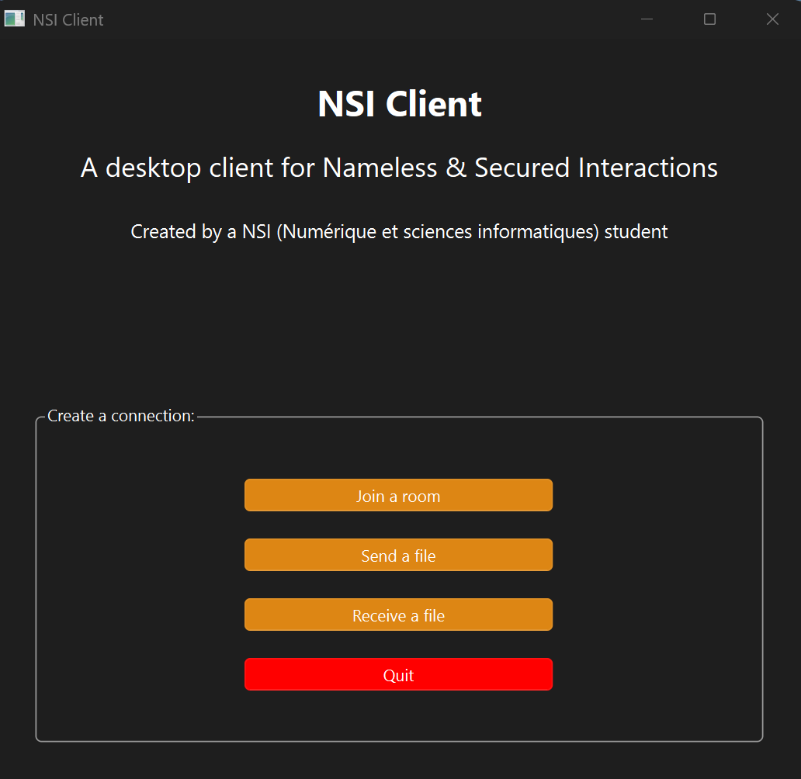

# NSI Client
## Un logiciel pour la diffusion anonyme, instantanée et éphémères de message et de fichiers

## Présentation
**NSI** : *Nameless & Secured Interactions*

**NSI Client** est un logiciel, écrit avec [Qt pour Python](https://doc.qt.io/qtforpython-6/), qui sert de client graphique pour interagir avec le serveur [NSI Server](https://github.com/Contrapunctus-XIV/nsi-server).

<div>
    <p align="center">
        
    </p>
</div>

## Démarrage rapide
Après avoir cloné le dépôt, ouvrez un terminal à la racine et installez les dépendances :
```
pip install -r requirements.txt
```

Il suffira ensuite d'exécuter le fichier `main.py` :
```
python main.py
```

## Fonctionnalités
### Salons

Le logiciel permet la connexion à des salons de discussion instantanée.

Pour s'y connecter, il suffit de renseigner un UUID arbitraire et un alias (optionnel, aléatoire si non-renseigné). Le salon sera créé côté serveur s'il n'existe pas encore.

Tous les pairs à qui vous partagerez l'UUID du salon seront en capacité de la rejoindre.

### Transactions
On désigne par *transaction* le processus qui met en relation deux pairs durant lequel l'un, appelé *émetteur*, envoie un fichier à l'autre, appelé *récepteur*.

Le déroulement d'une transaction est le suivant :
- L'émetteur se rend dans le menu approprié, renseigne le fichier à transmettre puis le logiciel génère l'UUID de la transaction et le socket qui le connectera au serveur ;
- Le serveur instantie la transaction ;
- L'émetteur communique l'UUID de la transaction au receveur ;
- Le receveur se connecte via le menu approprié en renseignant l'UUID de la transaction. Il reçoit ensuite les informations sur le fichier, choisit la destination du fichier et accepte la transaction ;
- L'émetteur lance la transaction, téléverse le fichier sur le serveur *via* un socket, puis le serveur relaie le fichier au receveur ;
- La transaction est terminée quand l'écriture du fichier côté receveur est terminée.

## Limitation
- Envoyer un trop gros fichier (> 200-300 MiB) en transaction freeze le GUI.